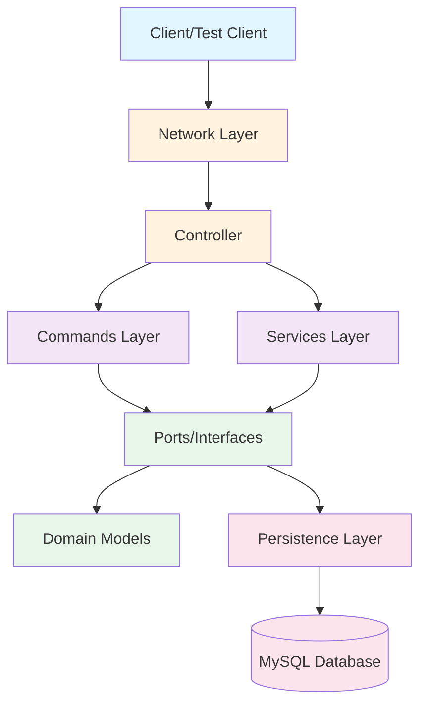
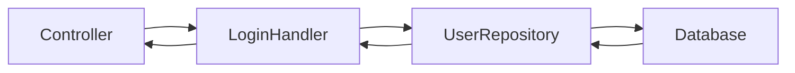
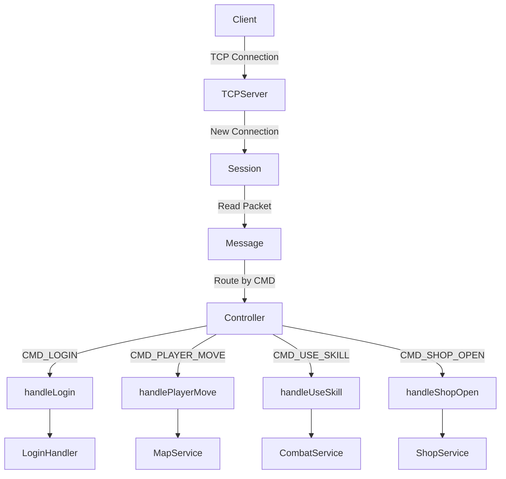
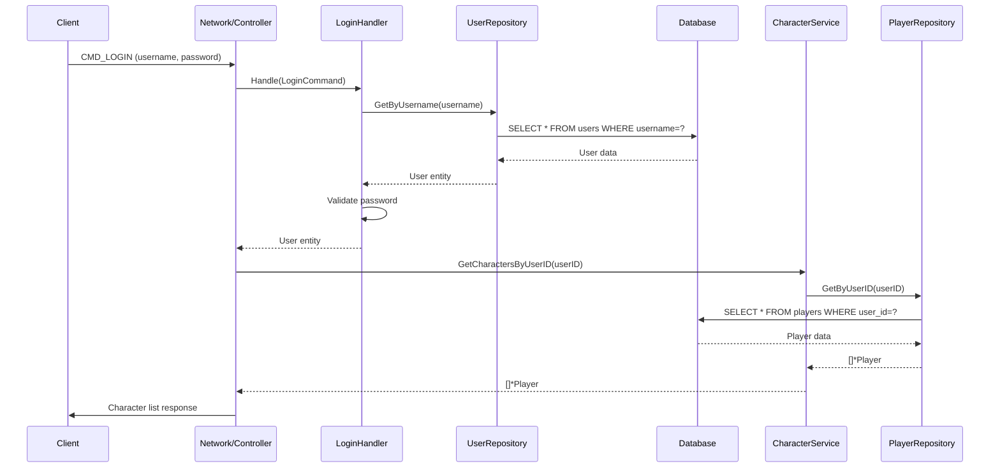
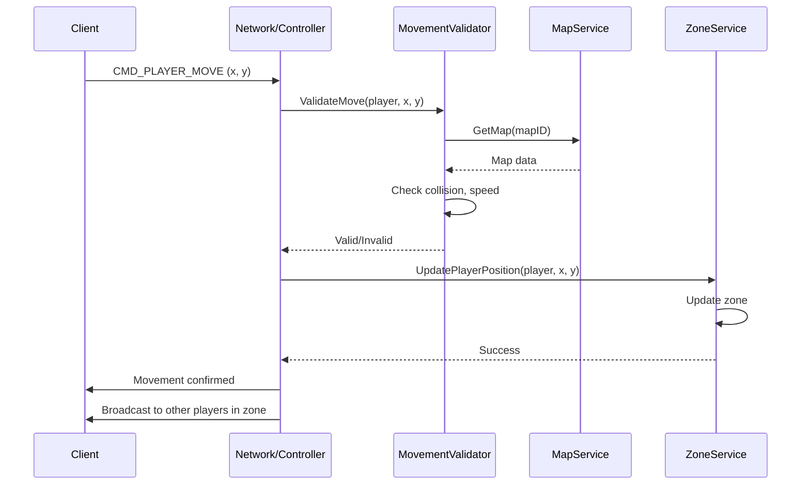
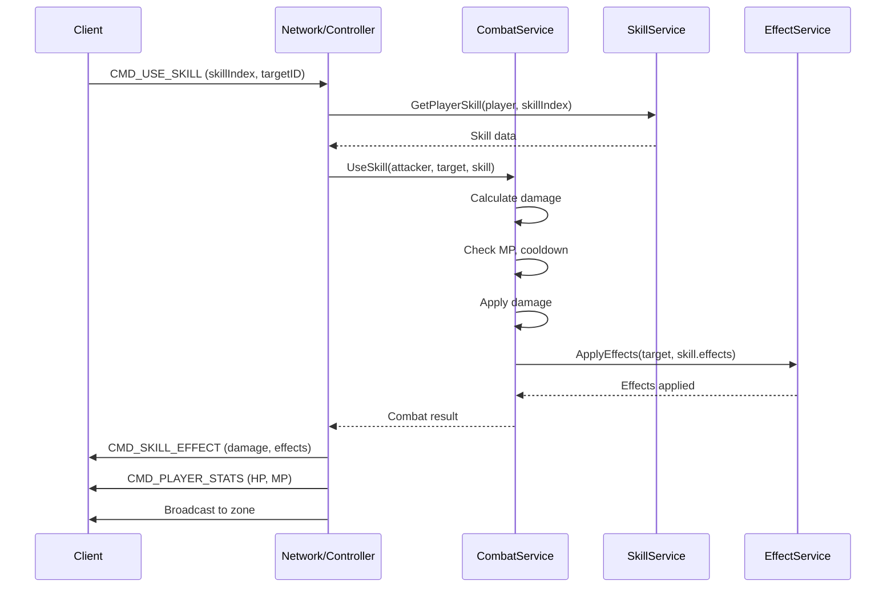
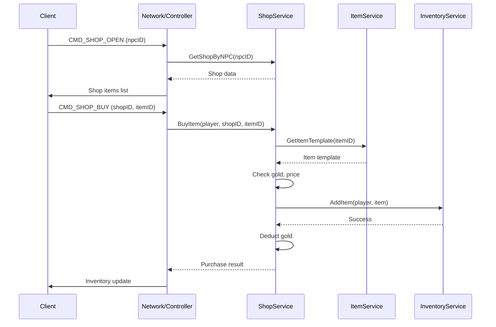
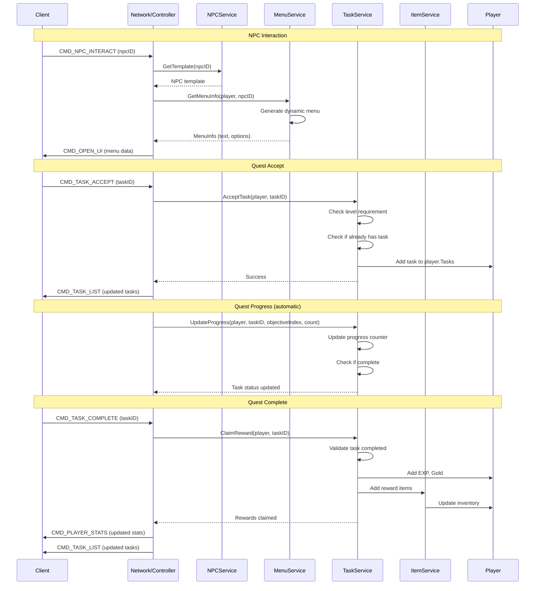
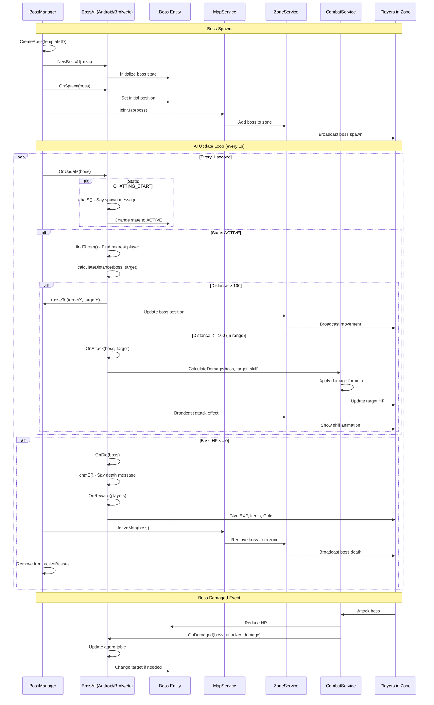
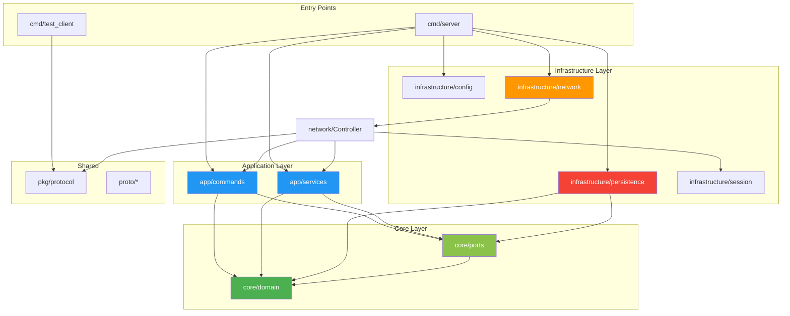

# NRO Go - Kiến Trúc Hệ Thống

> **Tài liệu kiến trúc chi tiết** - Giải thích cấu trúc, luồng dữ liệu và mối quan hệ giữa các module trong NRO Go Server

---

## 📋 Mục Lục

- [Tổng Quan Kiến Trúc](#tổng-quan-kiến-trúc)
- [Cấu Trúc Thư Mục](#cấu-trúc-thư-mục)
- [Chi Tiết Từng Module](#chi-tiết-từng-module)
  - [1. cmd/ - Entry Points](#1-cmd---entry-points)
  - [2. internal/ - Core Business Logic](#2-internal---core-business-logic)
  - [3. pkg/ - Shared Packages](#3-pkg---shared-packages)
  - [4. proto/ - gRPC Services](#4-proto---grpc-services)
- [Luồng Dữ Liệu](#luồng-dữ-liệu)
- [Dependency Graph](#dependency-graph)

---

## 🏗️ Tổng Quan Kiến Trúc

NRO Go Server được xây dựng theo **Clean Architecture** (Hexagonal Architecture) với các tầng rõ ràng:



### Nguyên Tắc Thiết Kế

1. **Dependency Inversion**: Các module cấp cao không phụ thuộc vào module cấp thấp, cả hai đều phụ thuộc vào abstraction (interfaces)
2. **Separation of Concerns**: Mỗi module có trách nhiệm rõ ràng
3. **Testability**: Dễ dàng test từng module độc lập
4. **Scalability**: Dễ dàng mở rộng thêm tính năng mới

---

## 📁 Cấu Trúc Thư Mục

```
go-src/src/
├── cmd/                    # Entry points (executables)
│   ├── server/            # Main game server
│   └── test_client/       # Test client for debugging
│
├── internal/              # Private application code
│   ├── app/              # Application layer
│   │   ├── commands/     # Command handlers (CQRS pattern)
│   │   └── services/     # Business logic services
│   │
│   ├── core/             # Core domain layer
│   │   ├── domain/       # Domain models (entities)
│   │   └── ports/        # Interfaces (repository contracts)
│   │
│   └── infrastructure/   # Infrastructure layer
│       ├── config/       # Configuration management
│       ├── network/      # TCP server & controller
│       ├── persistence/  # Database implementations
│       └── session/      # Session management
│
├── pkg/                   # Public packages (reusable)
│   └── protocol/         # Network protocol definitions
│
└── proto/                # Protocol Buffers (gRPC)
    ├── auth/             # Authentication service
    ├── item/             # Item service
    └── world/            # World service
```

---

## 🔍 Chi Tiết Từng Module

### 1. cmd/ - Entry Points

#### 📂 `cmd/server/`

**Mục đích**: Entry point chính của game server

**Đầu vào**:

- Config file: `Config.properties` (database credentials, server port, etc.)
- Command-line flags (optional)

**Đầu ra**:

- TCP Server listening on port (default: 14445)
- Initialized services và database connections

**Chức năng chính**:

```go
// main.go workflow:
1. Load configuration từ Config.properties
2. Connect to MySQL database (nếu RequireDB = true)
3. Initialize repositories (User, Player, Item, Skill, Map, Shop, NPC, Task)
4. Initialize services (Character, Map, Item, Skill, Shop, NPC, Task, Boss)
5. Initialize command handlers (Login)
6. Create network controller
7. Start TCP server
```

**Dependencies**:

- `internal/infrastructure/config` - Load config
- `internal/infrastructure/persistence` - Database connection
- `internal/infrastructure/network` - TCP server
- `internal/app/commands` - Command handlers
- `internal/app/services` - Business services

**Ảnh hưởng**: Là điểm khởi đầu của toàn bộ hệ thống

---

#### 📂 `cmd/test_client/`

**Mục đích**: Client giả lập để test server

**Đầu vào**:

- Server address (localhost:14445)
- Test credentials

**Đầu ra**:

- TCP connection to server
- Send/receive test packets

**Chức năng chính**:

- Connect to server
- Send login packet
- Receive và decode server responses
- Test protocol implementation

**Dependencies**:

- `pkg/protocol` - Protocol definitions

---

### 2. internal/ - Core Business Logic

#### 📂 `internal/app/commands/`

**Mục đích**: Implement **Command Pattern** (CQRS) cho các hành động có side-effects

**Files**:

- `login.go` - Login command handler

**Cấu trúc**:

```go
type LoginCommand struct {
    Username string
    Password string
}

type LoginHandler struct {
    userRepo ports.UserRepository
}

func (h *LoginHandler) Handle(cmd LoginCommand) (*domain.User, error)
```

**Đầu vào**: Command objects (LoginCommand)

**Đầu ra**: Domain entities hoặc errors

**Luồng xử lý**:



**Dependencies**:

- `internal/core/ports` - Repository interfaces
- `internal/core/domain` - Domain models

**Ảnh hưởng**: Được gọi bởi `network.Controller`

---

#### 📂 `internal/app/services/`

**Mục đích**: Business logic services - xử lý game mechanics

**Files** (28 services):

| Service | Mục đích | Đầu vào | Đầu ra |
|---------|----------|---------|--------|
| `character_service.go` | Quản lý nhân vật | UserID, CharacterID | Player entity |
| `map_service.go` | Quản lý maps & zones | MapID, ZoneID | Map/Zone data |
| `item_service.go` | Quản lý items & templates | ItemID | Item templates |
| `inventory_service.go` | Quản lý inventory | PlayerID, ItemID | Inventory operations |
| `skill_service.go` | Quản lý skills | SkillID, PlayerID | Skill data |
| `combat_service.go` | Xử lý combat logic | Attacker, Target, SkillID | Damage, effects |
| `shop_service.go` | Quản lý shops | ShopID, ItemID | Shop data |
| `npc_service.go` | Quản lý NPCs | NPCID | NPC data, dialogues |
| `task_service.go` | Quản lý quests | TaskID, PlayerID | Quest data |
| `clan_service.go` | Quản lý clans | ClanID | Clan data |
| `effect_service.go` | Quản lý buffs/debuffs | EffectID | Effect data |
| `event_service.go` | Quản lý events | EventID | Event data |
| `menu_service.go` | Quản lý menus | MenuID | Menu data |
| `movement_validator.go` | Validate movement | Position, Speed | Valid/Invalid |
| `zone_service.go` | Quản lý zones | ZoneID | Zone data |

**Boss AI Services** (10 files):

- `boss_manager.go` - Central boss management
- `boss_registry.go` - Boss AI registration
- `boss_data.go` - Boss templates
- `boss_template_loader.go` - Load boss data from JSON
- `boss_android.go` - Android AI
- `boss_black_goku.go` - Black Goku AI
- `boss_broly.go` - Broly AI
- `boss_cell.go` - Cell AI
- `boss_frieza.go` - Frieza AI
- `boss_nappa.go` - Nappa AI
- `boss_minor.go` - Minor bosses AI

**Pattern**: Singleton services với lazy initialization

```go
var (
    mapServiceInstance *MapService
    mapServiceOnce     sync.Once
)

func GetMapService() *MapService {
    mapServiceOnce.Do(func() {
        mapServiceInstance = &MapService{
            maps: make(map[int]*domain.Map),
        }
        mapServiceInstance.loadMockData()
    })
    return mapServiceInstance
}
```

**Dependencies**:

- `internal/core/domain` - Domain models
- `internal/core/ports` - Repository interfaces (optional, có thể dùng mock data)

**Ảnh hưởng**: Được gọi bởi `network.Controller` và các services khác

---

#### 📂 `internal/core/domain/`

**Mục đích**: Domain models (entities) - Pure business objects

**Files** (9 domain models):

| File | Entity | Mô tả |
|------|--------|-------|
| `user.go` | User, Player | Account và character |
| `item.go` | Item, ItemTemplate, Inventory | Items và inventory |
| `skill.go` | Skill, SkillTemplate, PlayerSkill | Skills |
| `map.go` | Map, Zone, Waypoint | Maps và zones |
| `npc.go` | NPC, NPCTemplate, PlayerTask | NPCs và quests |
| `shop.go` | Shop, ShopItem | Shops |
| `effect.go` | Effect | Buffs/Debuffs |
| `boss.go` | Boss, BossAI interface | Boss entities |
| `clan.go` | Clan | Clans/Guilds |

**Đặc điểm**:

- **No dependencies** on other layers (pure domain logic)
- Chứa business rules và validations
- Immutable khi có thể

**Ví dụ**:

```go
// user.go
type User struct {
    ID       int
    Username string
    Password string
    Role     int
    Ban      int
    Active   bool
    CreateAt time.Time
    UpdateAt time.Time
}

type Player struct {
    ID           int
    UserID       int
    Name         string
    Gender       int8
    HP, MP       int
    MaxHP, MaxMP int
    Power        int64
    MapID, ZoneID int
    X, Y         int16
    Inventory    *Inventory
    Skills       []*PlayerSkill
    Effects      []*Effect
    Tasks        []*PlayerTask
}
```

**Ảnh hưởng**: Được sử dụng bởi tất cả các layers khác

---

#### 📂 `internal/core/ports/`

**Mục đích**: Interfaces (contracts) cho repositories - **Dependency Inversion Principle**

**Files** (7 repository interfaces):

| File | Interface | Methods |
|------|-----------|---------|
| `repository.go` | UserRepository, PlayerRepository | GetByUsername, GetByID, Create, Update |
| `item_repository.go` | ItemRepository | GetItemTemplate, GetAllItems |
| `skill_repository.go` | SkillRepository | GetSkillTemplate, GetAllSkills |
| `map_repository.go` | MapRepository | GetMap, GetZone |
| `npc_repository.go` | NPCRepository | GetNPC, GetAllNPCs |
| `task_repository.go` | TaskRepository | GetTask, GetPlayerTasks |
| `shop_repository.go` | ShopRepository | GetShop, GetShopItems |

**Ví dụ**:

```go
// repository.go
type UserRepository interface {
    GetByUsername(username string) (*domain.User, error)
    Create(user *domain.User) error
}

type PlayerRepository interface {
    GetByUserID(userID int) ([]*domain.Player, error)
    GetByID(id int) (*domain.Player, error)
    Create(player *domain.Player) error
    Update(player *domain.Player) error
}
```

**Đầu vào**: Domain entities
**Đầu ra**: Domain entities hoặc errors

**Ảnh hưởng**:

- Implemented bởi `internal/infrastructure/persistence`
- Được sử dụng bởi `internal/app/commands` và `internal/app/services`

---

#### 📂 `internal/infrastructure/config/`

**Mục đích**: Configuration management

**Files**:

- `config.go` - Load và parse Config.properties

**Đầu vào**: `Config.properties` file

```properties
db.host=localhost
db.port=3306
db.name=nro
db.user=root
db.password=
server.port=14445
server.require_db=false
```

**Đầu ra**: Config struct

```go
type Config struct {
    DBHost     string
    DBPort     int
    DBName     string
    DBUser     string
    DBPassword string
    ServerPort int
    RequireDB  bool
}
```

**Ảnh hưởng**: Được sử dụng bởi `cmd/server` và `infrastructure/persistence`

---

#### 📂 `internal/infrastructure/network/`

**Mục đích**: Network layer - TCP server và message routing

**Files**:

- `tcp_server.go` - TCP server implementation
- `controller.go` - Message router và handler
- `session.go` - Session management (có thể)

**Luồng xử lý**:



**Controller Methods**:

```go
type Controller struct {
    loginHandler *commands.LoginHandler
    charService  *services.CharacterService
}

// Message routing
func (c *Controller) OnMessage(sess *Session, msg *Message) {
    switch msg.Cmd {
    case CMD_LOGIN:
        c.handleLogin(sess, msg)
    case CMD_PLAYER_MOVE:
        c.handlePlayerMove(sess, msg)
    case CMD_USE_SKILL:
        c.handleUseSkill(sess, msg)
    case CMD_SHOP_OPEN:
        c.handleShopOpen(sess, msg)
    // ... more handlers
    }
}
```

**Dependencies**:

- `pkg/protocol` - Protocol definitions
- `internal/app/commands` - Command handlers
- `internal/app/services` - Services
- `internal/infrastructure/session` - Session management

**Ảnh hưởng**: Entry point cho tất cả client requests

---

#### 📂 `internal/infrastructure/persistence/`

**Mục đích**: Database implementations - Implement repository interfaces

**Files** (9 repository implementations):

- `database.go` - Database connection management
- `user_repository.go` - Implement UserRepository
- `player_repository.go` - Implement PlayerRepository
- `item_repository.go` - Implement ItemRepository
- `skill_repository.go` - Implement SkillRepository
- `map_repository.go` - Implement MapRepository
- `npc_repository.go` - Implement NPCRepository
- `task_repository.go` - Implement TaskRepository
- `shop_repository.go` - Implement ShopRepository

**Ví dụ**:

```go
// user_repository.go
type MySQLUserRepository struct {
    db *sql.DB
}

func NewMySQLUserRepository(db *sql.DB) ports.UserRepository {
    return &MySQLUserRepository{db: db}
}

func (r *MySQLUserRepository) GetByUsername(username string) (*domain.User, error) {
    query := "SELECT id, username, password, role, ban, active FROM users WHERE username = ?"
    // ... SQL query execution
}
```

**Dependencies**:

- `internal/core/ports` - Repository interfaces
- `internal/core/domain` - Domain models
- `database/sql` - MySQL driver

**Ảnh hưởng**: Được inject vào commands và services

---

#### 📂 `internal/infrastructure/session/`

**Mục đích**: Session management - Track connected clients

**Files**:

- `session.go` - Session struct và methods

**Chức năng**:

- Store player state
- Manage connection lifecycle
- Handle disconnections

---

### 3. pkg/ - Shared Packages

#### 📂 `pkg/protocol/`

**Mục đích**: Network protocol definitions - Shared giữa client và server

**Files**:

- `commands.go` - Command IDs (CMD constants)
- `message.go` - Message struct
- `packets.go` - Packet encoding/decoding
- `session.go` - Session protocol helpers

**Protocol Structure**:

```go
// commands.go
type Cmd int8

const (
    CMD_LOGIN         Cmd = -1
    CMD_REGISTER      Cmd = -2
    CMD_PLAYER_MOVE   Cmd = -7
    CMD_USE_SKILL     Cmd = -11
    CMD_SKILL_EFFECT  Cmd = -14
    CMD_NPC_INTERACT  Cmd = -20
    CMD_SHOP_OPEN     Cmd = -44
    CMD_SHOP_BUY      Cmd = -45
    // ... more commands
)

// message.go
type Message struct {
    Cmd  Cmd
    Data []byte
}

// packets.go
func EncodeMessage(msg *Message) []byte
func DecodeMessage(data []byte) (*Message, error)
```

**Đầu vào**: Raw bytes từ TCP connection
**Đầu ra**: Structured Message objects

**Ảnh hưởng**: Được sử dụng bởi:

- `cmd/test_client` - Encode/decode messages
- `internal/infrastructure/network` - Parse incoming packets

---

### 4. proto/ - gRPC Services

**Mục đích**: Protocol Buffers definitions cho microservices (future expansion)

#### 📂 `proto/auth/`

**Files**:

- `auth.proto` - Service definition
- `auth.pb.go` - Generated Go code
- `auth_grpc.pb.go` - Generated gRPC code

**Service Definition**:

```protobuf
service AuthService {
    rpc Login(LoginRequest) returns (LoginResponse);
    rpc VerifyToken(VerifyTokenRequest) returns (VerifyTokenResponse);
}

message LoginRequest {
    string username = 1;
    string password = 2;
}

message LoginResponse {
    bool success = 1;
    string token = 2;
    string error = 3;
}
```

**Mục đích**: Tách authentication service thành microservice riêng

---

#### 📂 `proto/item/`

**Service**: Item management microservice

**Chức năng**:

- Get item templates
- Manage inventory
- Item transactions

---

#### 📂 `proto/world/`

**Service**: World/Map management microservice

**Chức năng**:

- Map data
- Zone management
- Player positions

---

## 🔄 Luồng Dữ Liệu

### 1. Login Flow



### 2. Player Movement Flow



### 3. Combat Flow



### 4. Shop Flow



### 5. NPC & Quest Flow



**Giải thích NPC/Quest Flow**:

1. **NPC Interaction**: Client click vào NPC → Server lấy NPC template → MenuService tạo menu động dựa trên player state → Gửi menu về client
2. **Quest Accept**: Client chọn nhận quest → TaskService kiểm tra điều kiện (level, đã có quest chưa) → Thêm vào player.Tasks
3. **Quest Progress**: Tự động cập nhật khi player hoàn thành objectives (kill monsters, collect items, etc.)
4. **Quest Complete**: Client yêu cầu nhận thưởng → TaskService validate → Trao thưởng (EXP, Gold, Items)

---

### 6. Boss AI Flow



**Giải thích Boss AI Flow**:

1. **Boss Spawn**:
   - `BossManager` tạo boss từ template
   - Assign AI controller (Android, Broly, Cell, etc.) dựa trên boss type
   - Gọi `OnSpawn()` để khởi tạo vị trí, stats
   - Add boss vào map/zone
   - Broadcast spawn event cho players

2. **AI Update Loop** (chạy mỗi 1 giây):
   - **CHATTING_START**: Boss nói lời chào → chuyển sang ACTIVE
   - **ACTIVE**:
     - Tìm target gần nhất
     - Nếu xa: di chuyển đến
     - Nếu gần: tấn công với skill
   - **Death Check**: Nếu HP <= 0 → OnDie() → trao thưởng → remove khỏi map

3. **Boss Damaged Event**:
   - Player tấn công boss
   - `CombatService` tính damage
   - Gọi `OnDamaged()` hook
   - AI cập nhật aggro table, có thể đổi target

4. **Boss AI Hooks** (Interface):

   ```go
   type BossAI interface {
       OnSpawn(boss *Boss)
       OnUpdate(boss *Boss)
       OnAttack(boss *Boss, target *Player)
       OnDamaged(boss *Boss, attacker *Player, damage int)
       OnDie(boss *Boss)
       OnReward(players []*Player)
   }
   ```

**Boss AI Patterns**:

- **Android AI**: Aggressive, high attack speed, teleport skill
- **Broly AI**: Berserker mode when HP < 50%, AOE attacks
- **Black Goku AI**: Clone summon, combo attacks
- **Cell AI**: Absorb mechanic, regeneration
- **Frieza AI**: Transform phases, energy ball spam

## 📊 Dependency Graph



---

## 🎯 Tóm Tắt Các Module

| Module | Trách Nhiệm | Đầu Vào | Đầu Ra | Dependencies |
|--------|-------------|---------|--------|--------------|
| **cmd/server** | Entry point, khởi tạo hệ thống | Config file | Running server | All modules |
| **cmd/test_client** | Test client | Server address | TCP connection | pkg/protocol |
| **app/commands** | Command handlers (CQRS) | Command objects | Domain entities | core/ports, core/domain |
| **app/services** | Business logic | Domain entities | Processed data | core/ports, core/domain |
| **core/domain** | Domain models | - | Pure entities | None |
| **core/ports** | Repository interfaces | - | Interface definitions | core/domain |
| **infrastructure/config** | Config management | Config file | Config struct | None |
| **infrastructure/network** | TCP server, routing | TCP packets | Routed messages | pkg/protocol, app/* |
| **infrastructure/persistence** | Database access | SQL queries | Domain entities | core/ports, core/domain |
| **infrastructure/session** | Session tracking | Connection | Session state | pkg/protocol |
| **pkg/protocol** | Protocol definitions | Raw bytes | Message structs | None |
| **proto/*** | gRPC services | Protobuf | gRPC stubs | google.golang.org/grpc |

---

## 🚀 Hướng Dẫn Mở Rộng

### Thêm Service Mới

1. Tạo domain model trong `internal/core/domain/`
2. Tạo repository interface trong `internal/core/ports/`
3. Implement repository trong `internal/infrastructure/persistence/`
4. Tạo service trong `internal/app/services/`
5. Thêm handler trong `internal/infrastructure/network/controller.go`
6. Thêm command constant trong `pkg/protocol/commands.go`

### Thêm Command Mới

1. Định nghĩa CMD constant trong `pkg/protocol/commands.go`
2. Tạo command struct và handler trong `internal/app/commands/`
3. Inject handler vào Controller
4. Thêm case trong `Controller.OnMessage()`

### Thêm Boss AI Mới

1. Tạo file `boss_<name>.go` trong `internal/app/services/`
2. Implement `BossAI` interface
3. Register trong `boss_registry.go`
4. Thêm template trong `boss_data.go` hoặc JSON file

---

## 📝 Notes

- **Clean Architecture**: Core domain không phụ thuộc vào bất kỳ layer nào khác
- **Dependency Injection**: Repositories được inject vào services và commands
- **Mock Data Support**: Services có thể hoạt động với mock data khi `RequireDB = false`
- **gRPC Ready**: Proto definitions đã sẵn sàng cho microservices architecture
- **Testable**: Mỗi layer có thể test độc lập nhờ interfaces

---

**Generated**: 2025-11-22  
**Version**: 1.0  
**Author**: NRO Go Team
